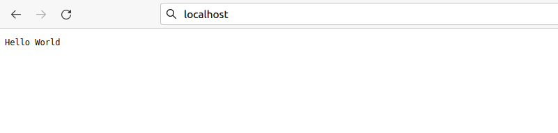

# folkatech-test

## Terraform
Buat sebuah file `main.tf` yang berisi konfigurasi centos7 aws
1. Setelah itu kita perlu menginisialisasi direktori dengan perintah `terraform init` untuk mengunduh dan instal provider yang didefinisikan dalam konfigurasi yang telah dibuat, yang dalam proyek ini menggunakan provider aws. 
   
   


2. Validasi konfigurasi Anda. Jika konfigurasi yang diprogram valid, maka Terraform akan mengembalikan pesan sukses.
   

3. Terapkan konfigurasi dengan perintah `terraform apply`. Maka terraform seharusnya akan mengeluarkan output seperti berikut:
   ```
   Terraform used the selected providers to generate the following execution plan.
   Resource actions are indicated with the following symbols:
   + create

   Terraform will perform the following actions:

      aws_instance.app_server will be created
   + resource "aws_instance" "app_server" {
         + ami                          = "ami-830c94e3"
         + arn                          = (known after apply)
   #...

   Plan: 1 to add, 0 to change, 0 to destroy.

   Do you want to perform these actions?
   Terraform will perform the actions described above.
   Only 'yes' will be accepted to approve.

   Enter a value:
   ```

   Namun karena saya tidak memiliki aws ....


## Aplikasi Node.Js sederhana

1. Kita siapkan sebuah aplikasi sederhana node.js, disini saya menggunakan aplikasi sederhana untuk menampilkan "Hello World"

```
var http = require("http");

http.createServer(function (request, response) {
   // Send the HTTP header 
   // HTTP Status: 200 : OK
   // Content Type: text/plain
   response.writeHead(200, {'Content-Type': 'text/plain'});
   
   // Send the response body as "Hello World"
   response.end('Hello World\n');
}).listen(8081);

// Console will print the message
console.log('Server running at http://127.0.0.1:8081/');
```

Aplikasi ini berfungsi untuk menampilkan halaman teks "Hello World" yang berjalan di server `localhost:8081`


## NGINX
1. Buat sebuah file konfigurasi baru untuk aplikasi Node.js kita di direktori `/etc/nginx/sites-enabled/.` 
2. Pada file konfigurasi tersebut, tentukan blok server untuk aplikasi nodejs kita. Sertakan port yang didengarkan, serta lokasi file statis yang dilayani aplikasi kita.
Dsini saya membuat sebuah file konfigurasi bernama `simple_nodejs.com`

```
server {
  listen 80;
  server_name simple-nodejs.com www.simple-nodejs.app;

  location / {
    proxy_pass http://localhost:8081;
    proxy_http_version 1.1;
    proxy_set_header Upgrade $http_upgrade;
    proxy_set_header Connection 'upgrade';
    proxy_set_header Host $host;
    proxy_cache_bypass $http_upgrade;
  }

}
```

3. Jalankan perintah `service nginx restart` untuk memulai ulang konfigurasi nginx
4. Buka browser dan jalankan localhost:80



Dapat dilihat bahwa aplikasi tersebut sudah berhasil di reverse proxy ke port 80 yaitu port http


## SSL
Untuk melakukan config SSL, disini saya menggunakan certbot. 
Certbot adalah sebuah alat perangkat lunak sumber terbuka gratis untuk menggunakan sertifikat **Let's Encrypt** secara otomatis di situs web yang dikelola secara manual untuk mengaktifkan HTTPS.

### Instalasi certbot
1. Untuk menginstall certbot di ubuntu 20.04, menggunakan perintah sebagai berikut
```
sudo apt install certbot python3-certbot-nginx
```

2. Langkah berikutnya adalah melakukan konfirmasi terhadap file konfigurasi nginx yang telah dibuat, certbot harus dapat menemukan blok server yang benar dalam konfigurasi Nginx Anda agar dapat mengonfigurasi SSL secara otomatis. 

Buka file konfigurasi `simple_nodejs.com`
```
server_name simple-nodejs.com www.simple-nodejs.app;
```

3. Jika domain nya ditemukan, maka kita dapat memperoleh SSL certificate nya dengan perintah berikut:
```
sudo certbot --nginx -d simple-nodejs.com -d www.simple-nodejs.com
```

