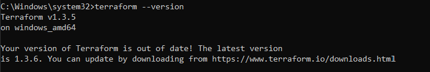

# folkatech-test

1. Kita siapkan sebuah aplikasi sederhana node.js, disini saya menggunakan aplikasi sederhana untuk menampilkan "Hello World"

```
var http = require("http");

http.createServer(function (request, response) {
   // Send the HTTP header 
   // HTTP Status: 200 : OK
   // Content Type: text/plain
   response.writeHead(200, {'Content-Type': 'text/plain'});
   
   // Send the response body as "Hello World"
   response.end('Hello World\n');
}).listen(8081);

// Console will print the message
console.log('Server running at http://127.0.0.1:8081/');
```
2. Install terraform, disini saya mennginstall terraform menggunakan chocolatey dengan versi 1.3.5



3. Buat sebuah file bernama `main.tf` yang berisi konfigurasi aws untuk mendeploy aplikasi node.js kita  

4. Kita lakukan Terraform init pada repository kita

